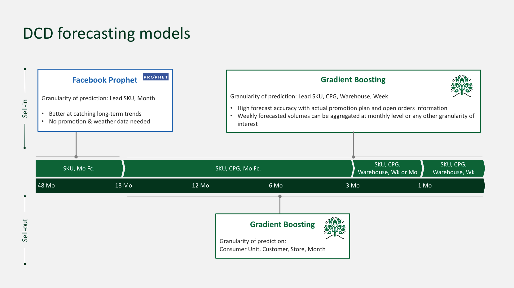

# Carlsberg Digitizing Consumer Demand (DCD) Project

BCG GAMMA project 
Phase 1 - (February to April 2019) - Development of a demand forecasting prototype for French pilot market. Client Data Scientist
team was in charge of expanding scope to Swiss and Russian markets, automating the data pipeline and deploying the tool in
Carlsberg production analytics platform (databricks).

Main deliverable: Prediction models to forecast sell-in demand for horizons varying from 1 week to 18 months.

# Installing project requirements

`
pip install -r requirements.txt
` 

# Single trainer (main.py)

Please specify configs information in yaml file in configs folder (default_france.yaml by default) and run the following
command in the main directory:

`
python main.py configs_file_name.yaml
`

The single trainer is able to train both sell-in prototype model and sell-out POC model. 

Whenever the parameters "evaluation_start" and "evaluation_end" are not left empty (integer corresponding to month 
or week number), training dates are automatically adjusted to prevent from overlapping with the test period.

Depending on settings, model for a given forecast horizon will be either trained or loaded from a pickle file. 

Performance of model is assessed on test set, whose dates can be specified in configs files, using the Carlsberg
metric (F.A.), the Carlsberg bias metric (F.B.), the root mean squared error and the weighted SMAPE.

## For sell-in:

Main data sources:
- Historical sales volumes 
- Open orders and shipments snapshots
- Sell-out promotions data (e.g. type of promotion, promotion window, rate, volume uplift)
- Rebates (i.e. discounts given to direct customers)
- Weather data (external web-scrapping)
- Events data (external web-scrapping)

Two types of sell-in models are available in the code.
- An XGBoost model is used to predict weekly volume demand (in HL) for all horizon between 1 and 52 weeks.
- A Facebook Prophet alghorithm is used to predict monthly volume demand (in HL) at SKU level for all horizons between 12 months and 18 months.

Sales volume are predicted using the XGBoost model at the lowest granularity, i.e. sales per:
- Week
- Lead SKU
- Warehouse (called plant at Carlsberg)
- Customer Planning Group (Carlsberg's grouping of individual customers)
Volumes can then be aggregated in post-processing stage. 

Performance of Machine Learning model is also compared to current Carlsberg APO forecasts whenever the 
"column_historical_forecast" parameter is specified in configs. 

## For sell-out:

The XGBoost model predicts monthly volume demands (in HL) between 1 to 12 months out. 

Sales volume are predicted using the XGBoost model at the lowest granularity, i.e. sales per:
- Month
- Consumer Unit (EAN UC)
- Customer (e.g. Carrefour, Carrefour Market, Intermarche, LeaderPrice)
- Individual Store 

# Multiple Trainer (main_trainer.py)

The project contains another script to automatically train multiple models sequentially. Configs must be specified in a
distinct configs file. The default configs is called "default_trainer.yaml". Please use it as a reference. 

When the code is run, one model is trained for each horizon between "smallest_horizon" and "largest_horizon" on the 
whole period between "train_start" and "train_end". Similar to the single trainer, evaluation dates are always used as 
the main driver whenever specified. Leave them as None, if you want to train on all the training horizon specified. 

`
python main_trainer.py configs_file_name.yaml
`

# Future Forecasts (main_future_forecasts.py)

The project contains another script to automatically predict volumes for all weeks in a given horizon (mostly for sell-in 
but it could for sell-out too). Settings must be specified in a distinct configs file, including:
- 'date_when_predicting'
- 'first_date_to_predict'
- 'last_date_to_predict'
- 'file_name_configs_model'

To ensure consistency regarding models parameters and features, please indicate the right configs file containing all 
information for the single model. The default configs is called "default_future_forecasts.yaml". Please use it as a reference. 

When the code is run, all relevant models are loaded to span all horizons. Predictions will be done for all combinations
specified in the 'predictions_list' file (please see DataLoader object for more information). A default 'predictions_list'
exists if needed (based on APO historical forecasts report). Predictions are then split between months for consistent 
monthly comparisons with APO. 

`
python main_future_forecats.py configs_future_forecasts.yaml
`

# Other functionalities for development puposes (not part of the main tool flow)

Two other (manual) codes are also included in the "evaluator" directory to assess the "true" performance of model 
during the development phase:

## Quarterly Trainer

"quarterly_trainer.py" code assess performance of model over a long period of time using models that are frequently 
retrained automatically in the code (quarterly in the current version). The user must manually specify 
the "evaluations" variable directly in the script. The performance is assess on all specified periods using all 
data available up to the beginning of that period to train the model. 

That performance assessment is closer to what we can expect to get once tool will be in production. 

## Month-3 performance assessment

This script is used to assess the performance of the model at month-3 since weekly forecast are generally not useful 3 
months ahead. 

Before using this script, please use the multiple trainer script to train the w-10, w-11, w-12 and w-13 models.
The first week of a calendar month is forecast 10 weeks ahead, the second week 11 weeks ahead and so on.
Weekly predictions are then aggregated per month. m-3 performance assessment compare monthly forecasts to the actual 
monthly sales.

Run the following command line the main directory:

`
python evaluator/evaluation_m3.py configs_file_name.yaml
`

## Monthly back-test
This script is used to assess the performance of the model at month-m horizon. 
That scripts allows to do all relevant predictions, and split them to get consistent monthly predictions.

Run the following command line the main directory:

`
python evaluator/monthly_back_test.py 201752 201801 201852 default_france.yaml
`

# Overview of DCD models

# Consolidated list of features in sell-in & sell-out models

